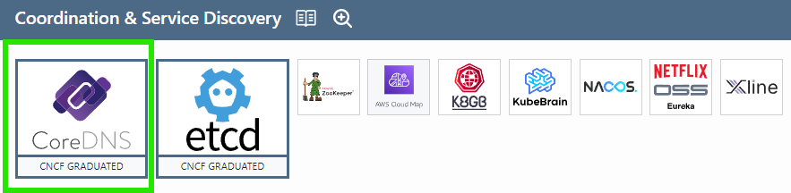

## Colors
- Green: Used or depended on in this course
- Red: I've used

## Application Definition & Image Build

- Helm: I used HELM to install Prometheus in part 2
- Docker Compose: Used by Docker, which was present in this course

## Database

- PostgreSQL: All my apps I built during the course used PostgreSQL
- MongoDB: I've used this outside the course
- Redis: This was present in part 2 of the course
- Supabase: I've used this outside the course

## Continuous Integration & Delivery

- Argo: Used in part 4 GitOps
- Flagger: Used in exercise 5.03
- GitHub Actions: Were used many times during the course
- Google Cloud Build: Used to build Docker images during part 3

## Streaming & Messaging

- NATS: Used in part 4 to create a messaging system between pods

## Scheduling & Orchestration

- Kubernetes: Used throughout the course
- Knative: Used in part 5 to deploy the serverless version of the pingpong app

## Service Proxy & Service Mesh

- NGINX: Used in exercise 5.04
- Linkerd: Used in part 5 of the course

## API Gateway

- Traefik Proxy: Used by k3d but I have no clue how it works

## Coordination & Service Discovery

- CoreDNS: Used by k3d but I have no clue how it works

## Cloud Native Networks

- Flannel: Used by k3d but I have no clue how it works

## Container Runtime

- containerd: Used by k3d but I have no clue how it works

## Security & Compliance

- SOPS: Used to encrypt secrets since part 2

## Container Registry & Key Management

- Google Container Registry: This was present in part 3 of the course
- OAuth2: Used by Google Cloud?

## Observabilitys

- Prometheus: Used to monitor the cluster in part 2
- Grafana: Used to monitor the cluster in part 2
- Grafana Loki: Used to monitor the cluster in part 2